# Customer Data Pipeline

> Flask API → Fetch Data → FastAPI Ingestion → Store → PostgreSQL Database

---

## 📌 Project Description

This project implements a complete data pipeline using three Docker services that communicate with each other:

- **Flask (Port 5000)** — Serves mock customer data from a JSON file with pagination support
- **FastAPI (Port 8000)** — Ingests data from Flask into PostgreSQL, and exposes query endpoints
- **PostgreSQL (Port 5432)** — Stores the customer records persistently

**Flow:**
```
Flask API (JSON) → FastAPI (Ingest) → PostgreSQL (Store) → API Response
```

---

## 🗂️ Project Structure

```
customer-pipeline/
├── docker-compose.yml
├── README.md
├── mock-server/
│   ├── app.py
│   ├── Dockerfile
│   ├── requirements.txt
│   └── data/
│       └── customers.json
└── pipeline-service/
    ├── main.py
    ├── database.py
    ├── Dockerfile
    ├── requirements.txt
    ├── models/
    │   └── customer.py
    └── services/
        └── ingestion.py
```

---

## ⚙️ Prerequisites

- Docker Desktop (running)

No Python, PostgreSQL, or any other tool needs to be installed on your machine.

---

## 🚀 How to Run

```bash
# Step 1: Start all 3 services
docker compose up -d

# Step 2: Wait ~30 seconds for services to be ready

# Step 3: Trigger ingestion
curl -X POST http://localhost:8000/api/ingest
```

---

## 📸 Screenshots

### 1. All 3 Containers Running — `docker compose ps`


---

### 2. Flask Health Check — `GET /api/health`

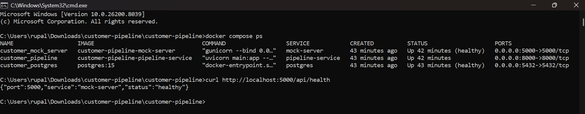


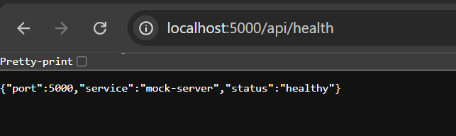

---

### 3. Flask Paginated Customers — `GET /api/customers?page=1&limit=5`

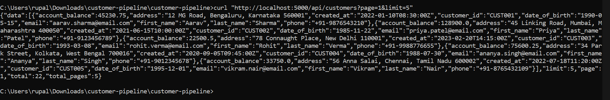

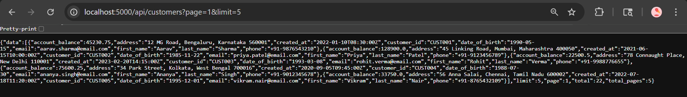


---

### 4. Flask Single Customer — `GET /api/customers/CUST001`

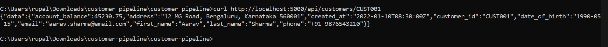

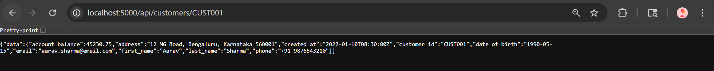

---

### 5. Data Ingestion — `POST /api/ingest`

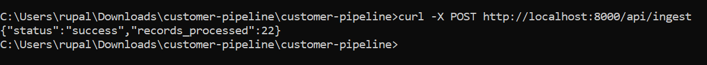

---

### 6. FastAPI Paginated Customers — `GET /api/customers?page=1&limit=5`

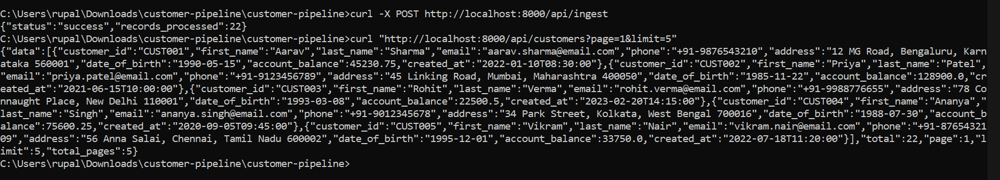

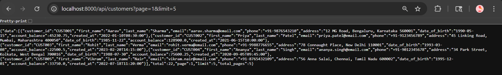

---

### 7. FastAPI Single Customer — `GET /api/customers/CUST001`

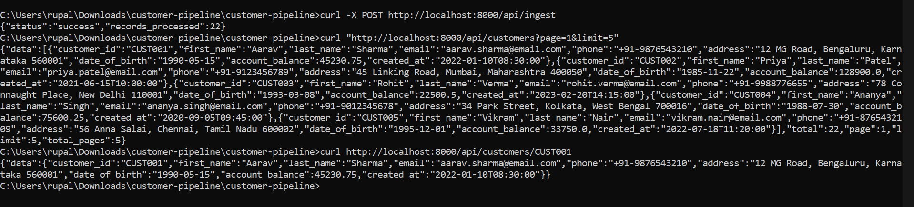

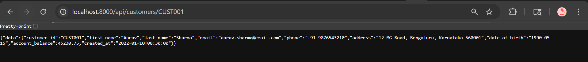

---

### 8. FastAPI Interactive Docs — `http://localhost:8000/docs`

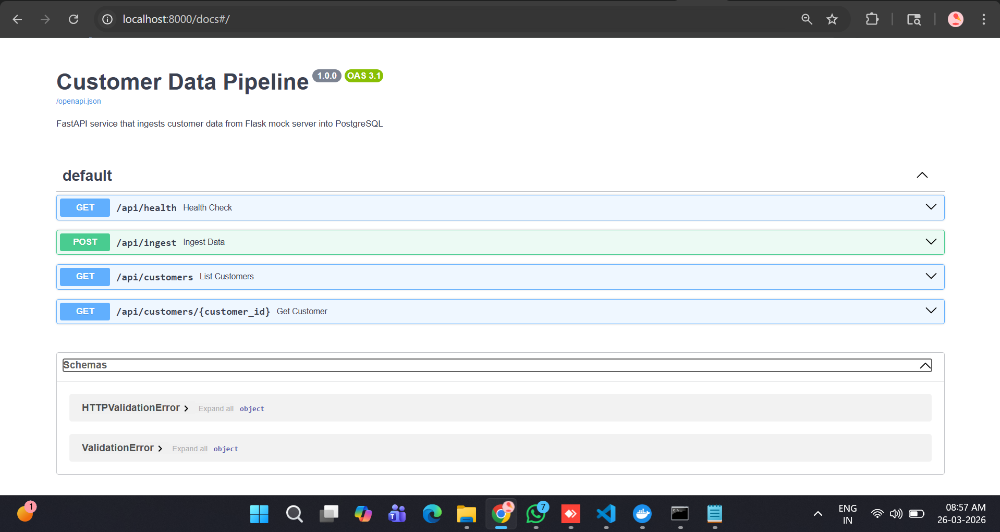

---

### 9. Docker Desktop

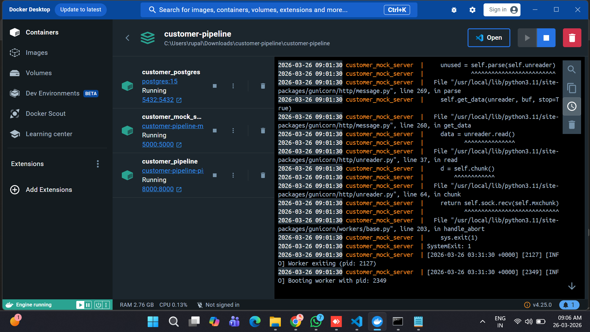


---

### 10. Github Console


---

## 🔗 API Endpoints

### Flask Mock Server — Port 5000

| Method | Endpoint | Description |
|--------|----------|-------------|
| GET | `/api/health` | Health check |
| GET | `/api/customers` | Paginated customer list (`?page=1&limit=10`) |
| GET | `/api/customers/{id}` | Single customer by ID |

### FastAPI Pipeline Service — Port 8000

| Method | Endpoint | Description |
|--------|----------|-------------|
| GET | `/api/health` | Health check |
| POST | `/api/ingest` | Fetch from Flask → upsert into PostgreSQL |
| GET | `/api/customers` | Paginated results from database |
| GET | `/api/customers/{id}` | Single customer from database |

---

## 🗃️ Database Schema

| Column | Type |
|--------|------|
| customer_id | VARCHAR(50) PRIMARY KEY |
| first_name | VARCHAR(100) NOT NULL |
| last_name | VARCHAR(100) NOT NULL |
| email | VARCHAR(255) NOT NULL |
| phone | VARCHAR(20) |
| address | TEXT |
| date_of_birth | DATE |
| account_balance | DECIMAL(15,2) |
| created_at | TIMESTAMP |

---

## 🛑 Stop Services

```bash
# Stop containers
docker compose down

# Stop and delete database data
docker compose down -v
```

---

## 🏗️ Architecture

```
┌─────────────────┐     HTTP/Pagination    ┌──────────────────────┐
│  Flask :5000    │ ◄────────────────────  │   FastAPI :8000      │
│  (mock server)  │   POST /api/ingest     │  (pipeline service)  │
│  customers.json │                        │  - auto-pagination   │
└─────────────────┘                        │  - upsert logic      │
                                           └──────────┬───────────┘
                                                      │ SQLAlchemy
                                                      ▼
                                           ┌──────────────────────┐
                                           │  PostgreSQL :5432    │
                                           │  customer_db         │
                                           │  customers table     │
                                           └──────────────────────┘
```

---

## 👤 Submitted By

**Name:** Rupal Patil  
**Email:** rupalpatil1617@gmail.com  
**LinkedIn:** https://www.linkedin.com/in/rupalpatil67/  
**Date:** 26 March 2026
